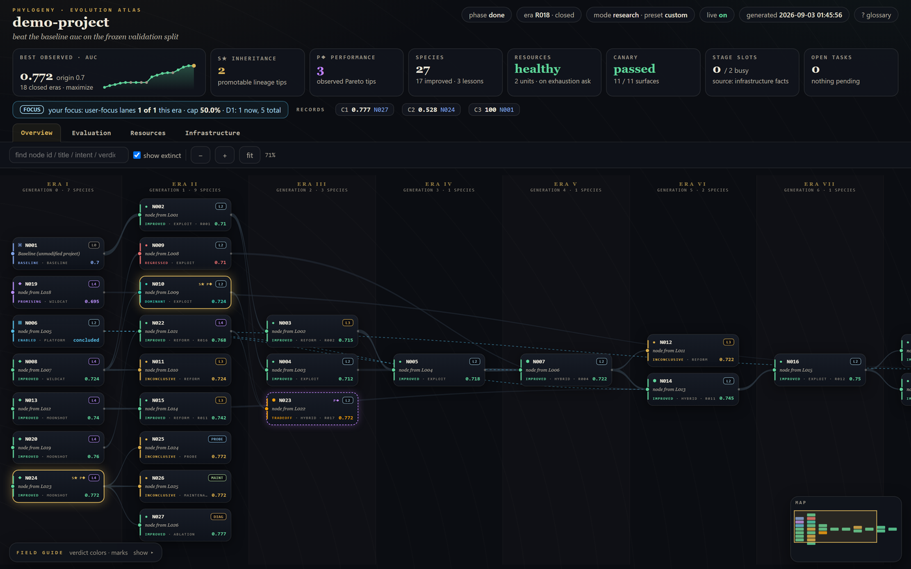

<b>English</b> &nbsp;·&nbsp; <a href="README.md">简体中文</a>

 

# 🧬 CLADE

### **C**losed-**L**oop **A**gentic **D**iscovery **E**ngine *for Machine Learning Research and Engineering*

### *Evolve your ML project the way organisms evolve*

### Ji Zhang &nbsp;·&nbsp; <a href="mailto:jizhang@g.harvard.edu">jizhang@g.harvard.edu</a>

 

 

The built-in dashboard: a single self-contained HTML file, refreshed as the run proceeds · sample data shown

 

---

## 📖 TL;DR

<table>
<tr><td width="130"><b>🔬 What it is</b></td><td>

An engine for automated ML scientific discovery and engineering iteration, with no learning curve and no configuration cost, that has produced results in real industrial and academic settings. It organises model experiments — differing in paradigm and in lineage — as a directed acyclic graph, and "evolves" your existing project in a manner analogous to biological evolution: it drives an agent to explore both improvements to the model you already have and entirely new paradigms unlike your current line of thought, in order to reach better results on the datasets and tasks you specify. Your agent queries the engine for the current task, completes it, and submits it for the engine to verify, round after round.

</td></tr>
<tr><td><b>👥 Who it is for</b></td><td>

Researchers and engineers in machine learning. The engine runs in one of two modes: **Research mode** aims at proposing novel mechanisms and competing for state of the art, while **Engineering mode** places a lower demand on methodological novelty, runs faster and costs less, and is aimed primarily at raising the numbers.

</td></tr>
</table>

 

## 🎒 What you need

### ✅ Required

 

**1️⃣ An existing ML codebase**

> It does not matter if it is unpolished or performs poorly: the engine does not depend on your method, and it will drive the agent to explore paradigms entirely unlike yours while it also improves what you have. Nor does it matter if the code has bugs — the engine will drive the agent to fix them until it runs.

**2️⃣ Any training infrastructure, and a way to reach it**

> It can be a cloud platform such as AutoDL, a GPU on your own machine, your own server, or an internal company AI hub. During configuration the engine drives the agent to learn end to end how your infrastructure is used, and asks you whenever it gets stuck. The engine supports running the coding agent, reading and writing datasets, GPU computation, and saving model weights on four different platforms, so it suits almost anyone's setup; if yours does not suit it, it will tell you during configuration rather than waste your time and resources.

**3️⃣ The datasets, tasks and evaluation criteria you specify**

> Multiple datasets, multiple tasks and multiple evaluation criteria are supported.

 

### 💡 Recommended

> [!TIP]
> A document on how your infrastructure is used. It need not be exhaustive, but it is best to mention the common pitfalls and sticking points. This holds especially for the hastily assembled, bug-prone infrastructure often found in industrial settings. If you are on a mature, low-bug platform such as AutoDL, or on a GPU in your own server, giving the access method is enough.

 

## 🚀 Thirty seconds to start

| | |
|:---:|:---|
| **1** | Download the CLADE archive to **any path** inside your ML project |
| **2** | Ask your coding assistant (Codex, Claude Code, …) to **unpack it** |
| **3** | Ask it to **read `OPERATOR_PROMPT.md` and evolve the current project** |
| **4** | Answer whatever the agent asks; once configuration is done, open the auto-generated `.evo/views/DASHBOARD.html` at your project root in a browser to watch the run |

> **No coding, no commands, no configuration file.** Configuration happens entirely through natural-language interaction: the engine asks you what it needs to know.

 

## ⭐ What CLADE offers over comparable projects

 

### ⚡ 1 · Thirty seconds to start, running on your own agent subscription

No coding, no commands, no configuration file. Just download the CLADE archive to any path inside your ML project, then ask your coding assistant (Codex, Claude Code and the like) to unpack it, read `OPERATOR_PROMPT.md` and evolve the current project. Configuration happens entirely through natural-language interaction: the engine asks you what it needs to know.

 

### 🏆 2 · Validated in practice

In a real industrial setting, CLADE's **Engineering mode** improved a recommendation model trained on a dataset of hundreds of millions of records, together with its post-training method, and delivered the largest gain obtained from model-side changes alone in five months. In one of our real research settings, CLADE's **Research mode** set new state of the art on 13 open datasets, and the mechanism it proposed passed a blind novelty review by human domain experts. As far as we know, at the time of this release, few open-source auto-research harnesses claim results of this kind. For confidentiality reasons we cannot disclose the specific settings. Because it has also been run long-horizon in several real settings, we have already walked into many of the pitfalls ourselves, so using this project may go better than you expect.

 

### 🔁 3 · Long-horizon operation

All evolution state is kept locally. A network outage, an exhausted quota, even switching to a different coding assistant (from Codex to Claude Code, say) can all be picked up seamlessly, with progress restored.

 

### 🧠 4 · It does research the way a human ML scientist does

Unlike certain auto-research projects that organise experiments as a tree or a linear pipeline, CLADE does not depend on the initial idea you supply: while it improves your model, it also explores paradigms unlike yours, and it represents the entire search as a **directed acyclic graph** rather than a tree. Your initial approach is only one of its root nodes; other roots may have paradigm lineages entirely unlike yours. Nodes can also be **crossed** to produce offspring carrying combined traits, and the experience of success or failure **propagates** through the graph, so the agent grows more capable as it goes. Unlike most auto-research projects — which largely drive an agent to read the literature and write code, or simply have an LLM propose an idea and dispatch sub-agents to check it for prior work — CLADE is designed in fine detail around how to innovate scientifically, and how to establish whether a given scientific mechanism actually works.

 

## ⚠️ Limitations of CLADE

 

> [!WARNING]
> ### 💰 1 · Heavy token consumption
>
> For reference: in our testing, the weekly Fable 5 quota of a Claude MAX 20× subscription was enough for only 4–5 evolution nodes, and the weekly Fable 5.1 quota for only 2–3. If you want CLADE to keep Fable working without interruption, you may need 2–3 MAX 20× subscriptions. We therefore recommend using CLADE with at least one Codex / Claude Code 20× subscription, or an equivalent token budget. (Even three subscriptions, however, are far cheaper than a human engineer, or than a graduate student.)

> [!WARNING]
> ### 📏 2 · Not validated at industrial LLM scale
>
> Our resources being limited, we have not run CLADE on the evolution of an industrial-scale LLM or anything of comparable size. In both Engineering and Research mode we have tested only deep learning models below 7B, with GPU scheduling below 16 cards. No agent harness can be made absolutely reliable; if your resources are tight, or you cannot absorb the loss of a failed experiment, please use it with care.

> [!WARNING]
> ### 🤖 3 · Bounded by the underlying model
>
> The engine's ceiling is set by the base model you use. We recommend a frontier model with strong instruction following. If your LLM follows instructions poorly — for instance, if it frequently does things outside its instructions, or is over-defensive to the point of hallucination — the engine will most likely deliver less.

> [!CAUTION]
> ### 🚧 4 · Still a work in progress
>
> This project is still being brought to completion. Although we have run long-horizon tests across several settings (a real one-month run in Research mode, 30+ nodes) and CLADE ships with several repair mechanisms, we still cannot guarantee that no deadlocks or other bugs occur during a run. The agent should be permitted to modify CLADE's engine code when a genuine bug in the engine's design has led to a deadlock, which is a further reason we recommend a frontier LLM.

 

## 📄 License

Released under the [MIT License](LICENSE) · Copyright © 2026 Ji Zhang

 

---

 

**🧬 CLADE**

*Closed-Loop Agentic Discovery Engine for Machine Learning Research and Engineering*

 

